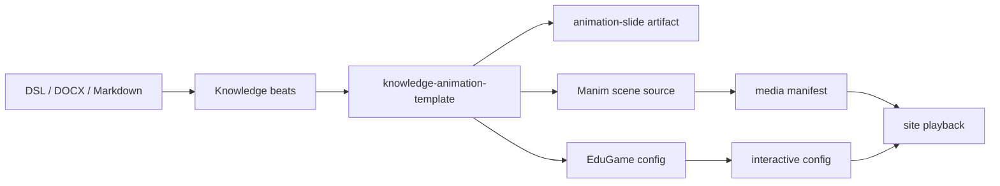

# 知识点动画模板方案

DGBook 使用 `knowledge-animation-template/v1` 作为动画和互动的共同约束层。模板不是截图，也不是把原始材料搬进画布，而是把知识点拆成顺序播放的 beat：画面保留短标签，解释交给播报。

## 目标

- 流程图线条由模板求解，避免箭头不连接、线段穿越和节点错位。
- 复杂概念使用多 stage page、转场和重点框，不把所有图形挤在一屏。
- 高价值概念片段可离线渲染为 Manim 视频，作为 `mediaTracks` 嵌入 `animation-slide`。
- 可操作练习使用 PixiJS EduGameKit 配置生成，并通过 `edugame-pixi` widget 嵌入教材。

## 流水线

## 约束

- 画布固定为 `1000x562`，桌面优先。
- 单屏说明文字控制在 80-120 个中文字符以内。
- 每 3.5 秒以内必须出现一次可见变化。
- 流程线必须连接节点，标签默认不超过 8 个字符。
- 工具痕迹、生成说明、调试文案禁止进入教材画面。

## 接口落点

- 模板 schema：`schemas/templates/knowledge-animation-template.v1.schema.json`
- Manim 资产 schema：`schemas/assets/manim-animation.v1.schema.json`
- Manim 构建入口：`node scripts/manim-build.mjs`
- EduGame 类型入口：`packages/edugame-core/src/types.ts`
- EduGame 审计入口：`pnpm audit:edugame-kit`
- 媒体校验入口：`node scripts/validate-media-assets.mjs`

## 当前边界

Manim 优先使用 `DGBOOK_MANIM_PYTHON`，其次使用 `runtime/media-python`，再退回 PATH。互动练习统一使用 EduGameKit 配置，不依赖外部游戏编辑器。
