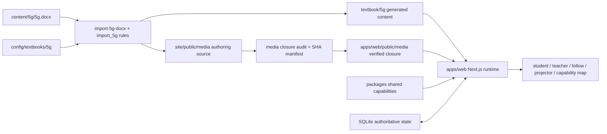

# DGBook 5G 数字教材架构总览

DGBook 当前以 5G 网络优化教材样张为产品主线。`apps/web/` 是唯一产品运行时，同一个 Next.js 应用承载学生自学、教师授课工作台、课堂跟随、投屏和课程能力图谱。

当前可发布主链路是：

`content/5g/5g.docx + 教材配置 -> 可复现导入器 -> textbook/5g 生成内容 + site/public/media 作者媒体源 -> 媒体闭包校验与切换 -> apps/web 产品运行时`

## 原则

- 源头可追踪：`content/5g/5g.docx` 是当前 5G 教材权威源；生成内容不作为长期手工编辑入口。
- 运行时唯一：根 `dev`、`build`、`typecheck` 和发布入口均指向 `apps/web/`。
- 数据口径唯一：学生、教师、投屏和图谱共用 SQLite 权威状态及同一快照投影。
- 媒体边界明确：`site/public/media/` 是导入器和作者工具的源输出；产品只读取通过路径、数量、字节和 SHA-256 校验的 `apps/web/public/media/` 运行闭包。
- 可发布优先：生成内容、媒体、数据、路由和界面必须共同通过单元、类型、结构、构建和浏览器门禁。
- 单向教材：不加入学生对话、roundtable、Q&A tutor 或讨论面板。

## 顶层目录

| 目录 | 当前职责 |
|---|---|
| `apps/web/` | 唯一 Next.js 产品运行时；包含路由、业务功能、SQLite 适配、状态机和快照投影 |
| `apps/web/public/media/` | 经验收的运行媒体闭包；为 Web 运行时唯一媒体根 |
| `content/5g/` | 5G 教材权威 DOCX 源 |
| `config/textbooks/5g/` | 教材 manifest、标题、术语、Manim 规则与文件命名配置 |
| `textbook/5g/` | 可重生的教材大纲、任务页、widget 引用、AST 和 P1 运行内容 |
| `site/public/media/` | 导入器与作者工具生成的媒体源；不是产品运行根 |
| `scripts/` | 导入、生成、校验、媒体切换、运行审计和发布编排 |
| `packages/` | 可复用的 animation、widgets、EduGame、shared 与生成能力 |
| `runtime/` | 作者侧本地 TTS、voice profile 与工具缓存；不进入产品运行闭包 |
| `artifacts/` | 媒体切换、源码发布包、SHA 和可追踪证据 |
| `docs/` | 架构、规范、计划与验收记录 |

## 数据与发布流

`site/public/media/` 与 `apps/web/public/media/` 之间不是运行时 fallback 关系。前者可包含还未被产品引用的作者资产；后者必须与已接受的媒体 manifest 精确一致，不允许目录遍历、符号链接、大小写绕过或回退读取作者源。

## 核心对象

| 对象 | 作用 |
|---|---|
| `textbook.manifest.json` | 登记权威源、导入规则、生成输出与质量门禁 |
| `lesson-ast` | 导入后的标准化教材语义树 |
| `knowledge-atom` | 可教学的最小知识单元 |
| `storyboard-beat` | 一段讲解与视觉动作 |
| `visual-script` | 生成动画前的中间表示 |
| `animation-slide` | 可由产品页面消费的动画 artifact |
| `game-config` | EduGameKit 互动练习配置 |
| `media-cutover-manifest` | 记录运行媒体闭包的路径、字节和 SHA-256 |
| `shared snapshot` | 将 SQLite 权威状态投影到学生、教师、投屏和图谱 |
| `diagnostic` | 校验、阻断与警告的统一结构 |

## 最小可发布闭环

1. 修改权威教材源、教材配置或导入规则。
2. 运行可复现导入，生成 `textbook/5g/` 内容与 `site/public/media/` 作者媒体源。
3. 校验 AST、widget、Manim、TTS 和产品内容契约。
4. 依白名单构建媒体闭包，通过逐文件 SHA-256 验证后原子切换到 `apps/web/public/media/`。
5. 运行单元、类型、结构、生产构建和浏览器旅程验证。
6. 生成带清单与 SHA 的 `apps/web` 源码发布包，在服务器构建并原子切换。

## 风险与假设

- DOCX/PDF 解析质量可能波动，必须先转换为可审计 AST，不应在页面层手工补齐多份内容。
- 发布音频以已验证的缓存和 manifest 为准，不依赖运行中的云 TTS 服务。
- Manim、D3、Dagre 和 PixiJS EduGameKit 等能力只作为可替换实现，不进入核心教材状态模型。
- 作者媒体源、SQLite 数据库、已接受的媒体清单和 current/previous 发布证据都是受保护资产，不进入常规临时文件清理。
