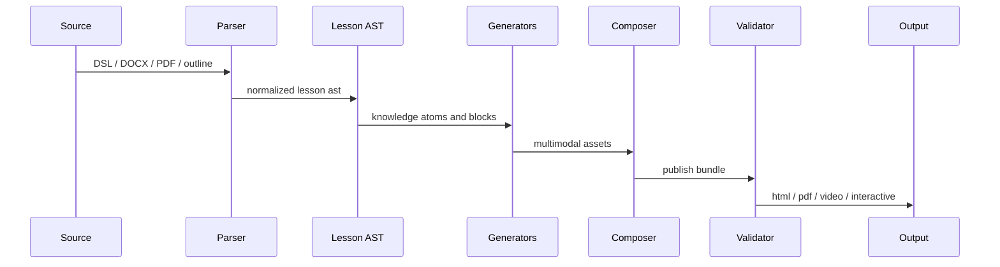

# 流水线与插件机制

## 主流水线



## 阶段契约

| 阶段 | 输入 | 输出 | 失败处理 |
|---|---|---|---|
| `source-normalizer` | DOCX/PDF/大纲/DSL | `lesson-source` | 输出结构缺失诊断 |
| `dsl-parser` | `lesson-source` | `lesson-ast` | schema error 阻断 |
| `knowledge-extractor` | `lesson-ast` | `knowledge-atom[]` | 无知识点阻断 |
| `storyboard-compiler` | `knowledge-atom[]` | `storyboard-beat[]` | 无视觉策略阻断 |
| `asset-generators` | `storyboard-beat[]` | `asset-manifest` | 单模态失败可降级 |
| `composer` | `asset-manifest` | `publish-bundle` | 引用缺失阻断 |
| `validator` | `publish-bundle` | `diagnostic[]` | blocking error 阻断 |
| `publisher` | 已通过 bundle | HTML/PDF/视频/交互页 | 写入失败阻断 |

## TypeScript 接口草案

```ts
export interface PipelinePlugin<I = unknown, O = unknown> {
  id: string;
  kind: 'parser' | 'extractor' | 'generator' | 'composer' | 'validator' | 'publisher';
  version: string;
  accepts(input: unknown): input is I;
  run(input: I, context: PipelineContext): Promise<PipelineResult<O>>;
}

export interface PipelineContext {
  projectRoot: string;
  locale: string;
  cacheDir: string;
  outputDir: string;
  diagnostics: Diagnostic[];
}

export interface PipelineResult<T> {
  value?: T;
  diagnostics: Diagnostic[];
}

export interface Diagnostic {
  level: 'error' | 'warning' | 'info';
  code: string;
  message: string;
  targetId?: string;
  sourceId?: string;
  blocking: boolean;
}
```

## 插件注册

插件只做一件事，避免耦合：

```yaml
plugins:
  parsers:
    - id: markdown-parser
    - id: docx-parser
  generators:
    - id: teaching-stage-generator
    - id: qwen-tts-generator
    - id: html-page-generator
  validators:
    - id: schema-validator
    - id: layout-validator
    - id: screenshot-validator
```

## 生成器输出契约

### Animation Generator

输入：`storyboard-beat[]`

输出：`animation-slide` artifact、timeline cues、layout diagnostics。

阻断：元素越界、文字裁切、关键元素重叠、动作目标缺失、连续 8 秒无视觉变化。

### Narration Generator

输入：`storyboard-beat[]` 和 voice config。

输出：`narration` asset、音频文件、manifest。

阻断：发布态 speech 缺 `audio-url`、音频文件不存在、文本未做 spoken normalization。

### Text Generator

输入：`lesson-ast`。

输出：MDX/HTML text blocks。

阻断：标题层级跳跃、source-id 缺失、公式无法解析。

### Graphics Generator

输入：`knowledge-atom[]`。

输出：SVG/Canvas-friendly graphics asset。

阻断：图形无坐标系、对象缺 id、引用图标不存在。

### Video Generator

输入：animation asset、narration asset、subtitle asset。

输出：可选 mp4/webm 与字幕文件。

阻断：轨道时间线不连续、音频缺失、字幕超出视频时长。

## 目录输出

```text
build/
  ast/lesson-ast.json
  assets/animation/*.json
  assets/narration/*.json
  assets/graphics/*.json
  media/tts/*.wav
  media/video/*.webm
  reports/diagnostics.json
  publish/html/
```

## 最小策略

短期只实现 YAML DSL、animation、narration、HTML 发布。PDF 和视频先走插件接口占位，不进入主路径。
