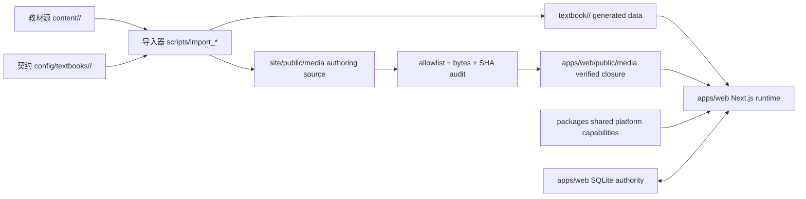

# 教材资产与平台代码边界

本文件用于收尾当前 5G 教材，并为后续教材复用 DGBook 底座。当前优先级是完成 5G 样张闭环；多教材能力只作为目录和契约约束。原则是：权威教材源可替换，生成产物可重建，平台能力可复用，产品运行时只有 `apps/web/`。

## 目录职责

| 区域 | 角色 | 可放内容 | 不应放内容 |
| --- | --- | --- | --- |
| `content/` | 权威教材源 | DOCX、Markdown、导入前资料 | React 组件、产品页面代码 |
| `config/textbooks/` | 教材契约 | `textbook.manifest.json`、术语、标题、文件名和专业规则配置 | 运行状态、临时缓存 |
| `textbook/` | 可重建的教材数据 | `outline.json`、`projects/*.mdx`、`widgets/*.json`、生成 AST 和 P1 运行内容 | 运行时代码、手写 UI 组件 |
| `site/public/media/` | 作者媒体源 | 导入器或生成器产生的图片、Manim 视频、TTS 音频和源 manifest | 产品运行时 fallback、TypeScript、Python |
| `apps/web/public/media/` | 已验证运行媒体闭包 | 已接受 manifest 中逐文件校验过的图片、视频、音频和 TTS manifest | 未登记媒体、临时 staging、手工备份、源码 |
| `apps/web/src/` | 唯一产品运行时代码 | Next.js 路由、鉴权、学习与课堂功能、SQLite 适配、快照投影、媒体适配 | 教材权威正文、页面各自写死的班级统计 |
| `apps/web/.data/` | 本地运行数据 | SQLite 数据库及受控备份 | 教材源、可入库源码、可清理缓存 |
| `packages/` | 可复用平台能力 | animation、widgets、EduGame、generation、shared | 单本教材正文与大媒体 |
| `packages/edugame-assets/` | 游戏素材包 | asset manifest、程序化素材声明、授权说明 | 某一页专用题干和答案 |
| `scripts/import_5g/` | 5G 专业导入规则 | 专业知识归纳、模板参数、导入规则 | 通用产品运行时组件 |
| `scripts/` | 工具链入口 | importer、TTS、Manim、QA、媒体切换、边界与发布审计 | 产品运行页面、正式数据库 |
| `artifacts/media-cutover/` | 媒体闭包证据 | 发布级 manifest、SHA sidecar、journal 和 current 指针 | 编辑中的媒体源、不可追踪手工副本 |

## 数据流



生成页和媒体闭包都不是长期手工编辑入口。教材内容、动画、游戏或 TTS 需要调整时，优先修改 `content/`、`config/textbooks/`、`scripts/import_*` 或模板包，然后重新生成。完成生成不等于已发布；只有通过媒体闭包审计并原子切换后，媒体才能进入 `apps/web/public/media/`。

## 后续新教材约定

1. 新教材源文件进入 `content/<book-id>/`。
2. 每本教材在 `config/textbooks/<book-id>/textbook.manifest.json` 登记权威源、专业规则、生成输出和质量门禁。
3. 教材生成数据进入 `textbook/<book-id>/` 或现有 manifest 指定的可区分路径。
4. 作者媒体首先输出到 `site/public/media/<book-id>/` 或 manifest 指定的作者源，不因此自动成为运行资产。
5. 产品需要的媒体经显式白名单、路径、字节和 SHA-256 校验后进入 `apps/web/public/media/`；应用不得回退读取作者源。
6. 通用能力进入 `packages/`，不得写死某个项目页 ID；专业规则进入 `scripts/import_<book-id>/`。
7. 游戏素材统一登记到 `packages/edugame-assets/asset-manifest.json`。
8. TTS 缓存必须有 manifest，文本 hash、URL 与实体文件必须一致；站点播放不依赖运中的 TTS 服务。
9. 新教材产品页仍进入 `apps/web/`，不新建第二个运行时。

## 可执行门禁

运行：

```powershell
pnpm audit:textbook-boundaries
pnpm audit:textbook-manifests
pnpm audit:web-media-cutover
pnpm web:check-structure
```

这些门禁共同确保：

- `textbook/`、`content/`和 `site/public/media/` 不混入产品源码。
- `packages/`、`apps/web/src/` 和 `scripts/` 不混入单本教材大媒体或正式数据库。
- `apps/web/public/media/` 与已接受媒体 manifest 的路径、数量、字节和 SHA-256 完全一致。
- Web 产品运行时不依赖第二套页面源码，也不从 `site/public/media/` 回退加载。
- 每本教材都有 manifest，且 manifest 指向的权威源、规则目录和生成输出存在。

## 当前 5G 闭包判断

当前必须保留并分别对待：

- `content/5g/5g.docx` 是权威源文档。
- `textbook/5g/` 是可通过导入器重建、但当前产品必需的生成内容。
- `site/public/media/5g/`、`site/public/media/manim/` 和 `site/public/media/tts/` 是 importer/authoring 媒体源，不是产品运行根。
- `apps/web/public/media/` 是经已接受 manifest 验证的产品运行闭包。
- `apps/web/.data/`、已验证媒体、媒体切换清单和 current/previous 发布证据都不得当作临时文件删除。

后续清理或隔离任何路径前，必须先证明它不在导入、运行、构建、发布或回滚闭包中，并生成可逆的隔离清单。
