# DGBook P1 数字教材使用教程

本教程面向第一次使用 DGBook 的教师、学生和课堂投屏操作人员，覆盖 P1“5G 网络信息采集”完整样张。线上入口：`http://8.153.206.97/`。

教程中的 `01`—`30` 主要为 2026 年 7 月 19 日线上版本 `20260719T021001Z-b73f236b09ea-ad1b0513c50d` 的基础界面截图；其中 `10`、`10b`、`17b`、`20b`、`23b` 已按当前线上版本 `20260719T062009Z-fd666099c432` 重采。`31`—`37` 同样来自当前版本的真实学习闭环：`student01` 从干净状态依次完成学习、正式测试、专业产出、教师退回、修订再提交和教师认证，闭环报告记录为 0 个浏览器错误、0 个失败。证据采集完成后，教师已通过界面再次重置演示数据；因此当前线上基线是学生一未开始、学生二退回演示、学生三完整演示，课堂处于准备中。

> 两组截图的版本来源均在本教程中明确标注。基础界面图用于说明稳定页面结构；涉及状态、成绩、提交、认证和图谱回流时，以当前版本真实闭环图为准。截图没有通过开发者工具伪造，也没有把演示数据冒充真实用户事件。

## 1. 演示账号与人物状态

| 身份 | 账号 | 密码 | 重置后的用途 |
|---|---|---|---|
| 教师 | `teacher01` | `123456` | 授课工作台、课堂控制、匿名讲评、成果复核 |
| 学生一 | `student01` | `123456` | 未开始状态；`P1T1-N01` 可学习，`P1T1-N02` 仍受前置门禁；用于演示从零学习、练习、测试和首次提交 |
| 学生二 | `student02` | `123456` | 演示教师退回与修订状态；不能直接冒充一次真实再次提交 |
| 学生三 | `student03` | `123456` | 演示数据中的 P1 完整达成；用于查看完整成果、V1/V2 差异和成果包 |

系统只有一个登录表单，不需要先选“学生端”或“教师端”。输入账号和密码后，系统自动识别身份：学生进入“我的学习首页”，教师进入“授课工作台”。

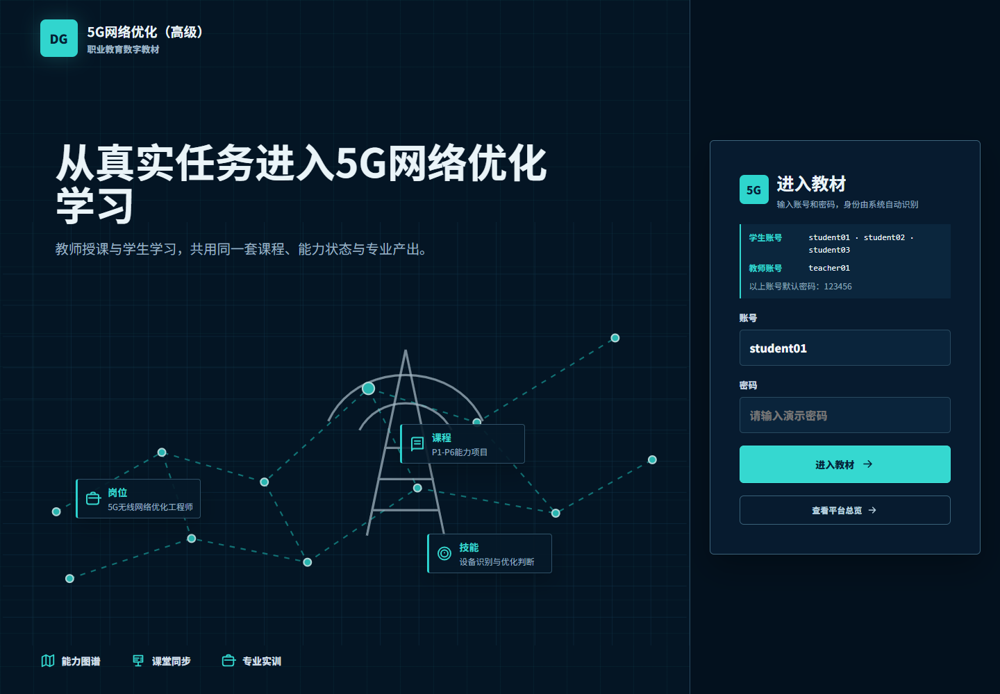

## 2. 十分钟快速演示路线

首次向学校、教师或评审人员演示时，推荐按以下顺序走一遍：

1. 用 `student01` 登录，展示学生首页如何回答“我正在学什么、为什么学、下一步做什么、做到什么算完成”。
2. 打开“查看其他任务”，展示 P01 → P02 → P03 的前后关系和项目成果包。
3. 退出 `student01`，改用 `student03` 进入 `P1T1-N02`，展示“问题、看图、步骤、纠偏、练习、产出”六段自学正文。若坚持使用 `student01`，必须先真实完成 `P1T1-N01`，不能绕过门禁。
4. 退出学生账号，用 `teacher01` 登录。重置后的课堂处于“准备中”且没有活动课时；展开工作台主入口，选择 `P1T1-N02`，两次点击进入 P01 第一课时授课页。
5. 另开一个教师登录窗口访问 `/present/demo-class`，展示投屏与教师翻页同步。
6. 再用学生账号进入 `/classroom/demo-class`，点击“进入课堂”，展示课堂跟随和“自主浏览”互不覆盖。
7. 用 `student03` 打开 P1 成果包，展示三份职业产出、P01 的 V1/V2 差异、证据、批注和正式测试诊断。
8. 回到教师授课页，打开右上角“授课与学情检查器”，切换“讲稿 / 学情 / 批阅”。

## 3. 登录、身份识别与退出登录

### 3.1 登录

1. 访问 `http://8.153.206.97/`。
2. 在“账号”中输入学生或教师账号。
3. 在“密码”中输入 `123456`。
4. 点击“进入教材”。按钮在校验时显示“正在验证”。
5. 学生会进入 `/student/home`，教师会进入 `/teacher/workbench`。

登录页同时提供“查看平台总览”，用于了解“输入材料 → 内容诊断与检索补强 → 课程能力图谱 → 资源生成 → 审核治理 → 数字教材 → 教学应用 → 数据回收”的平台流程；正式学习与授课仍需登录。

### 3.2 退出登录

学生首页、学习页、课堂跟随页和教师业务页右上角显示“学生/教师 · 姓名”和“退出登录”。点击“退出登录”后，系统结束当前会话并返回登录页。课堂跟随学生退出时，系统会先退出当前课堂参与状态，再结束登录。投屏端为共同展示画面，不提供“退出登录”；需先点击“返回教师端”，再从教师页面退出。

### 3.3 切换人物时的注意事项

- 同一浏览器窗口同一时间只保留一个账号身份。切换人物前先退出登录。
- 教师端、投屏端和学生端需要同时演示时，使用不同浏览器上下文或隐私窗口，避免登录 Cookie 相互覆盖。
- 不要用修改 URL 的方式绕过节点门禁。锁定节点只显示前置要求，不会载入教材、练习或提交功能。

## 4. 学生端

### 4.1 学生首页：30 秒找到正确入口

学生登录后默认进入 `/student/home`，不是完整能力图谱。首页主卡片直接给出四类信息：

1. “我正在学什么”：当前项目、当前任务、当前能力节点。
2. “为什么学”：说明当前能力与岗位任务的关系。
3. “下一步做什么”：显示当前状态要求。
4. “做到什么算完成”：显示可检查的完成标准。

“继续学习”是页面唯一主按钮。若学生主动加入了正在进行的课堂，它进入“课堂跟随”；其他情况下从个人自学游标继续。右侧“查看其他任务”和“课程能力图谱”都是次级入口。

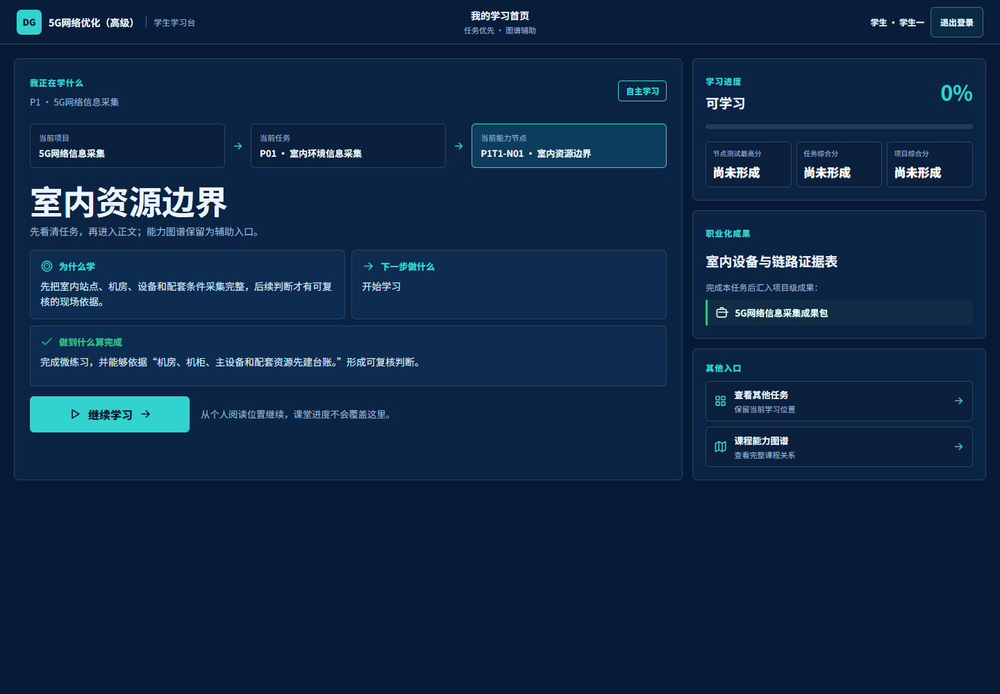

页面还区分三类成绩：

- 节点测试最高分：单个正式测试的历史最高分。
- 任务综合分：正式测试与专业产出评价形成的任务级成绩。
- 项目综合分：P01、P02、P03 三个任务冻结成绩的项目级汇总。

没有真实事件时显示“尚未形成”；预置人物数据会明确标记“演示数据”。

当 `student01` 真实完成 P01 的学习、N02 正式测试、N04 专业产出和教师认证后，首页仍保留 P01 当前上下文，当前节点显示 `P1T1-N04 · 资料归档`，状态变为“能力达成”，任务综合分显示教师冻结的真实成绩。本次线上闭环为 100 分；点击“继续学习”后再进入下一能力节点，课堂游标不会覆盖该个人进度。

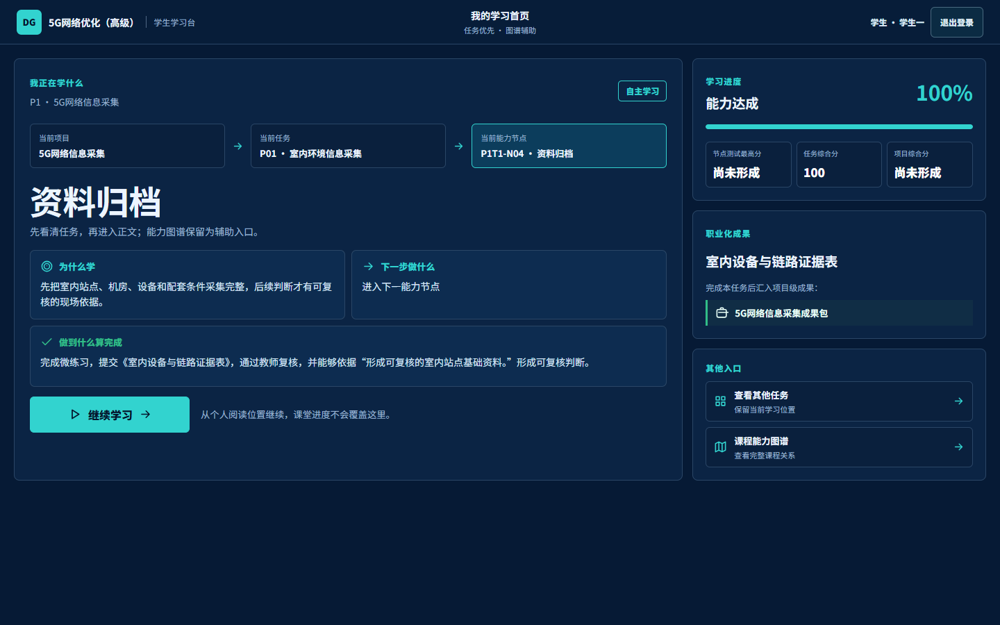

### 4.2 P1 项目页：理解三个任务的前后关系

从学生首页点击“查看其他任务”，进入 `/student/projects/p1`。页面顶部显示当前任务、下一步和完成标准；下方以任务链展示：

- P01：室内信息采集，形成“室内设备与链路证据表”。
- P02：室外信息采集，形成“室外站点与覆盖采集表”。
- P03：投诉信息采集，形成“投诉信息调查单”。

三个任务均包含 N01、N02、N03、N04 四个能力节点，并按 P01 → P02 → P03 顺序组织。后一任务的解锁条件不是笼统的“看完前一任务”，而是上游任务的 N02 正式测试达标，并且 N04 专业产出至少完成一次真实提交。最终项目产出为“5G 网络信息采集成果包”。

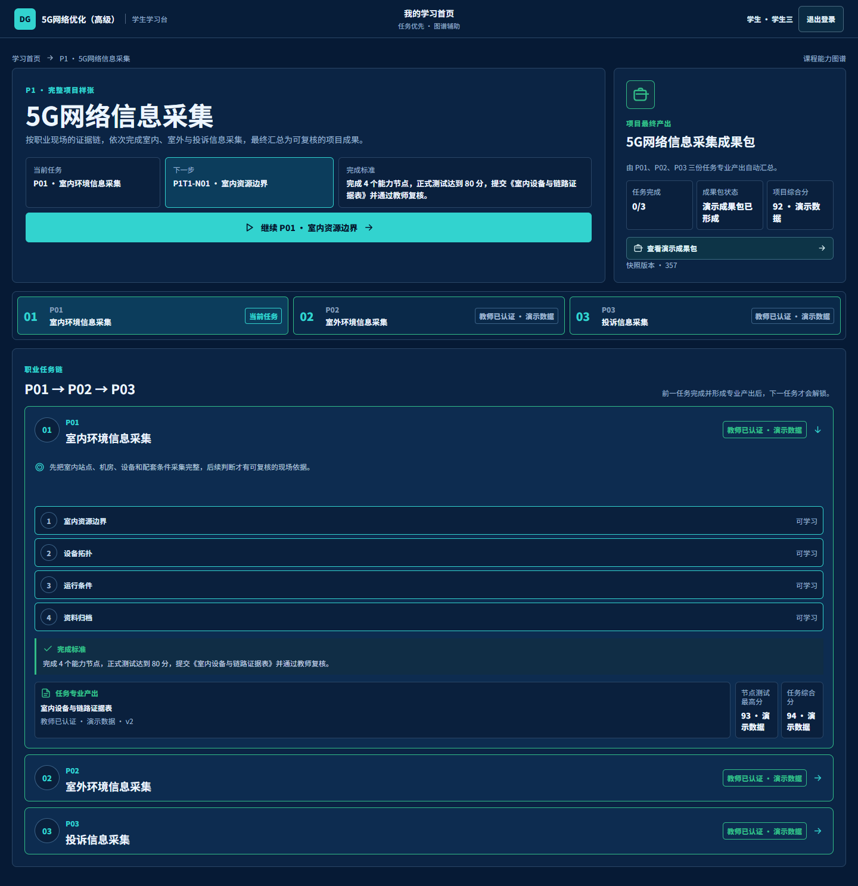

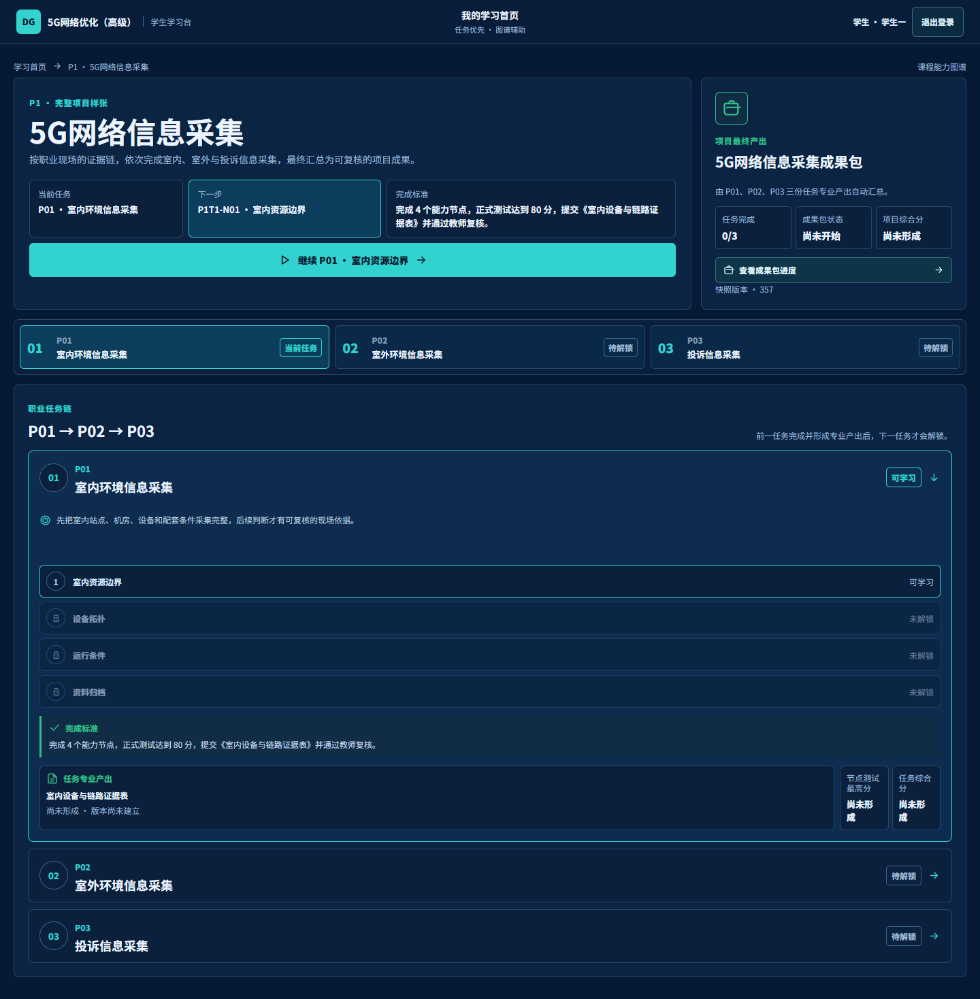

若节点卡片显示锁定，先查看节点下方状态和前置节点；直接访问锁定 URL 仍只会看到“需要先完成：……”提示。

### 4.3 N02 自学：六段正文如何使用

以 P01 的 `P1T1-N02 · 设备拓扑` 为例，页面地址为 `/learn/P1T1-N02`。顶部六段导航为“问题、看图、步骤、纠偏、练习、产出”，可自由前后阅读；底部“上一学习段”“下一学习段”不会受教师课堂翻页影响。

重置后的 `student01` 只解锁 `P1T1-N01`。在 N01 的必需微练习尚未通过时，直接输入 N02 地址只会显示前置要求，不会加载六段正文。需要快速查看完整 N02 样张时使用 `student03`；需要演示真实学习推进时，则由 `student01` 先通过 N01 必需微练习，再从项目页或“继续学习”进入 N02。

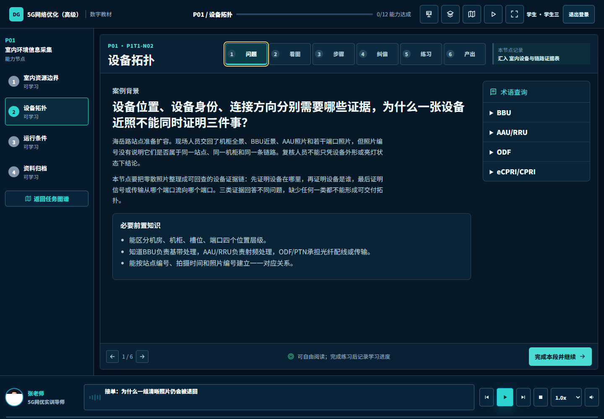

#### 问题

阅读案例背景、任务问题和必要前置知识。完成本段后点击“完成本段并继续”。打开页面本身不等于完成学习。

#### 看图

查看带标注的工程关系图和“判断依据”。重点回答：

- 设备位置需要哪些现场与空间证据；
- 设备身份需要哪些铭牌、型号、序列号证据；
- 连接方向需要哪些两端端口、连续走线和中间跳接证据；
- 为什么单张照片不能直接替代一条可复核证据链。

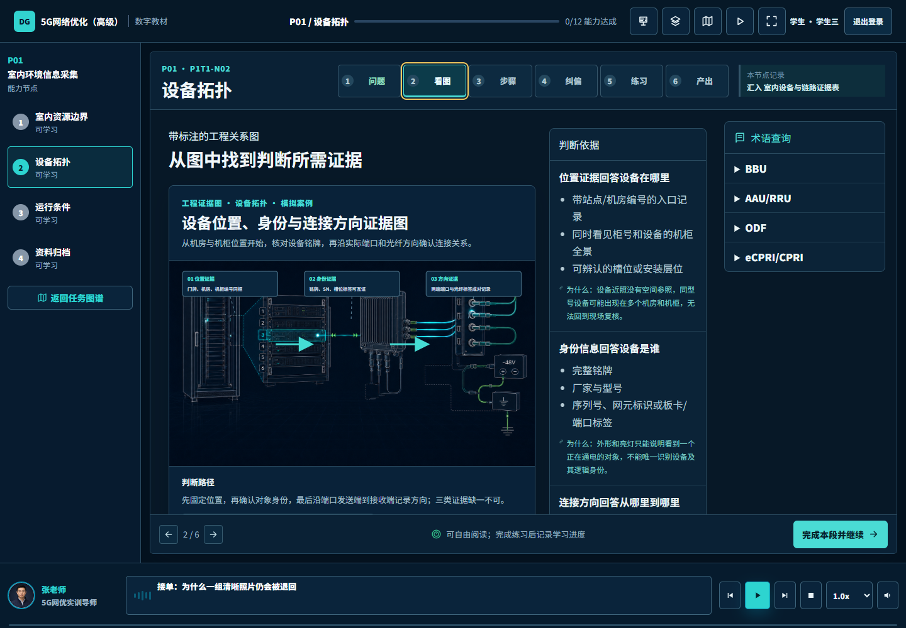

#### 步骤

按“证据 → 判断 → 结论”查看逐步推理和完整示例。不要只记结论，要能说明每一步使用了哪一份材料。

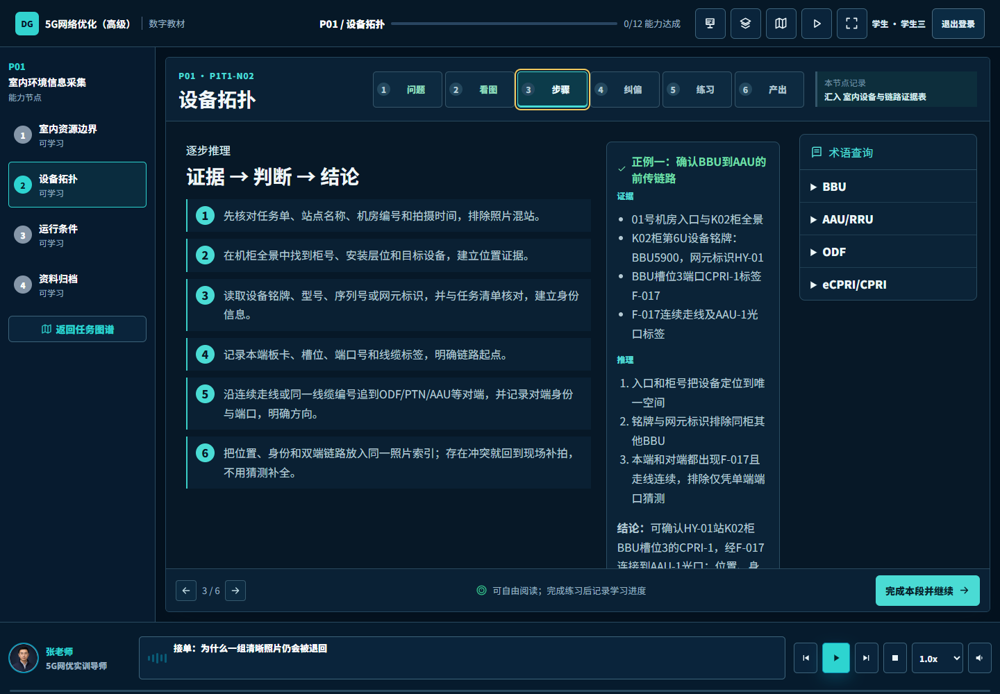

#### 纠偏

阅读至少两个反例。每个反例均列出“错误做法”和“改正路径”，用于区分“材料真实”与“材料足以证明结论”。

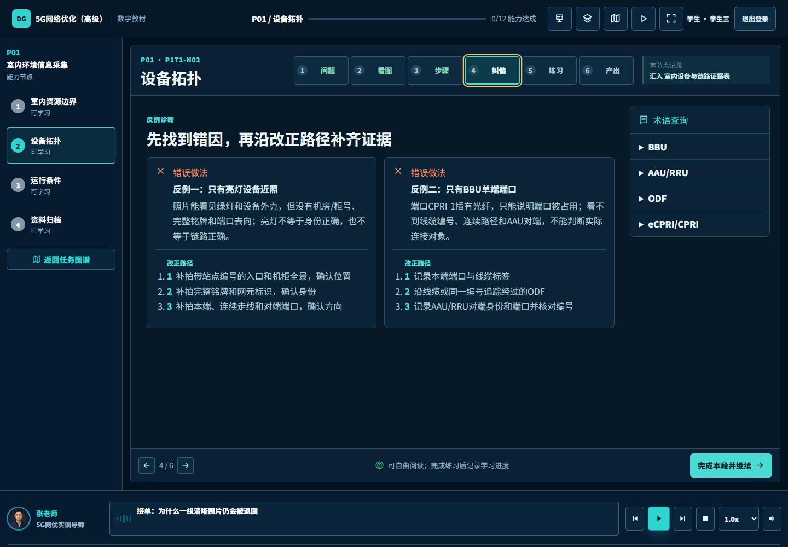

#### 练习

完成基础、应用、迁移等岗位练习。练习会提供具体材料、实际操作、针对性反馈和重新作答。只有服务端判定通过，才计入学习状态。

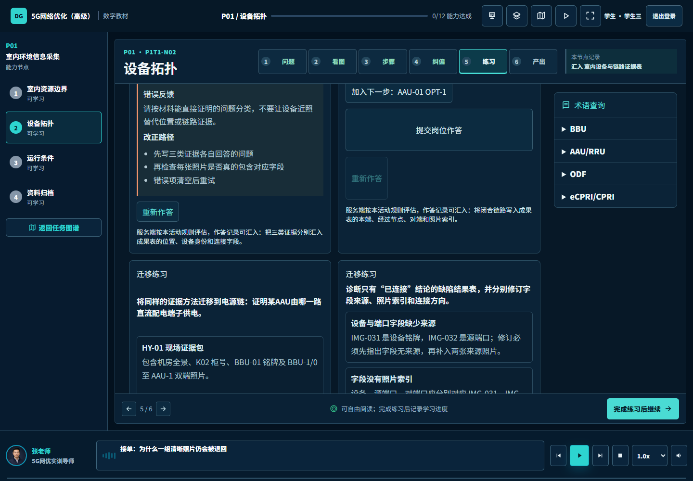

应用练习要求在候选链路 A/B 中选出可复核闭环，并给出排除另一候选的明确依据；迁移练习切换为 AAU 直流供电链，需填写 AAU、PWR、DCDU、端口、电压和连接方向，不能复用光链字段。

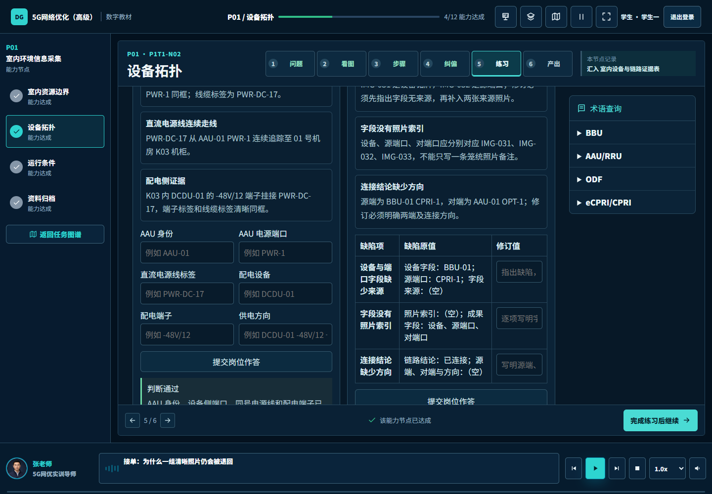

#### 产出

查看节点学习记录模板、迁移任务和评价标准。这里形成节点记录；任务级专业成果在 N04 统一填写。分层练习全部通过后，可点击“记录本节点学习完成”或进入下一节点。

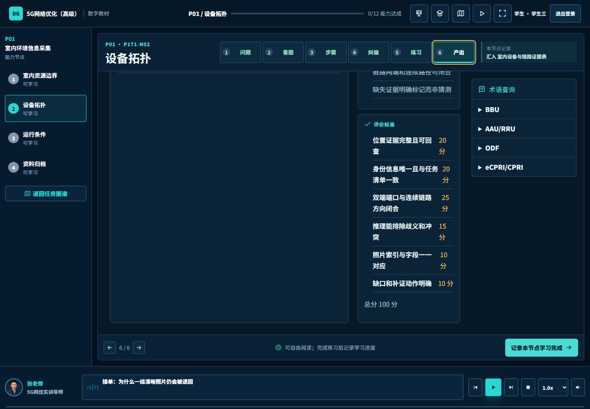

右侧“术语查询”可展开术语解释；顶部还可收起/展开学习路径、打开“节点信息”、返回“课程图谱”、暂停动效或全屏显示。

### 4.4 自主学习与课堂跟随

课堂地址为 `/classroom/demo-class`。学生首次进入时看到“尚未进入课堂”，必须主动点击“进入课堂”后，才接收教师当前讲授页。

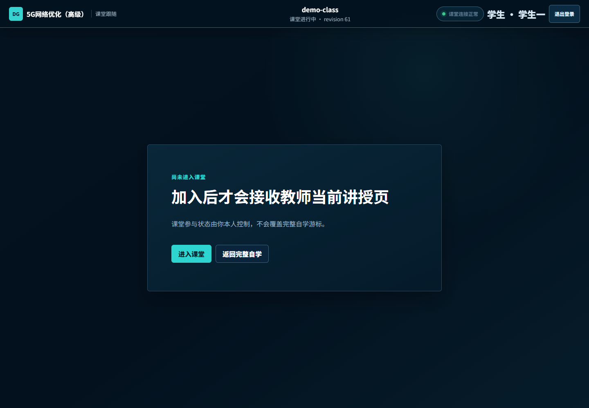

课堂跟随页只显示当前课堂位置、教师任务、课堂活动和返回完整自学的入口。教师翻页后，主动跟随的学生同步变化。

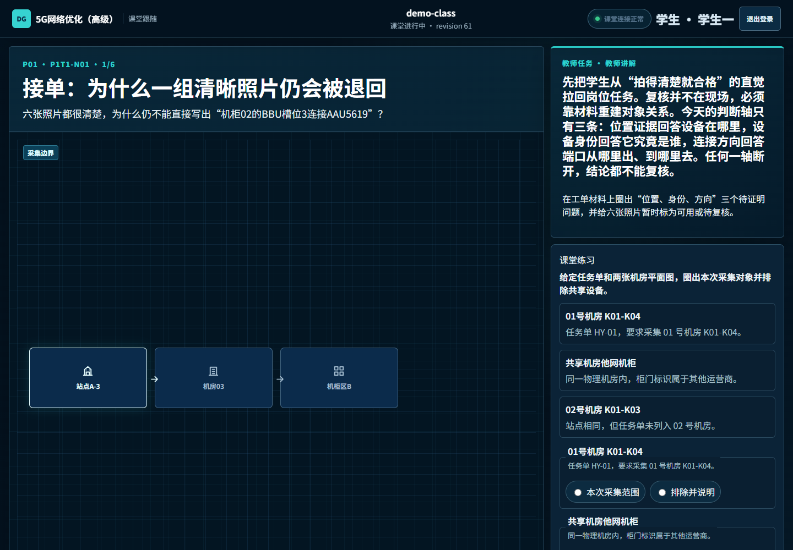

需要自行查阅完整教材时，点击“自主浏览”。此时页面提示“个人阅读位置保持不变”；教师继续翻页不会覆盖个人阅读游标。可选择“返回完整自学”，或点击“回到教师当前页”重新跟随。

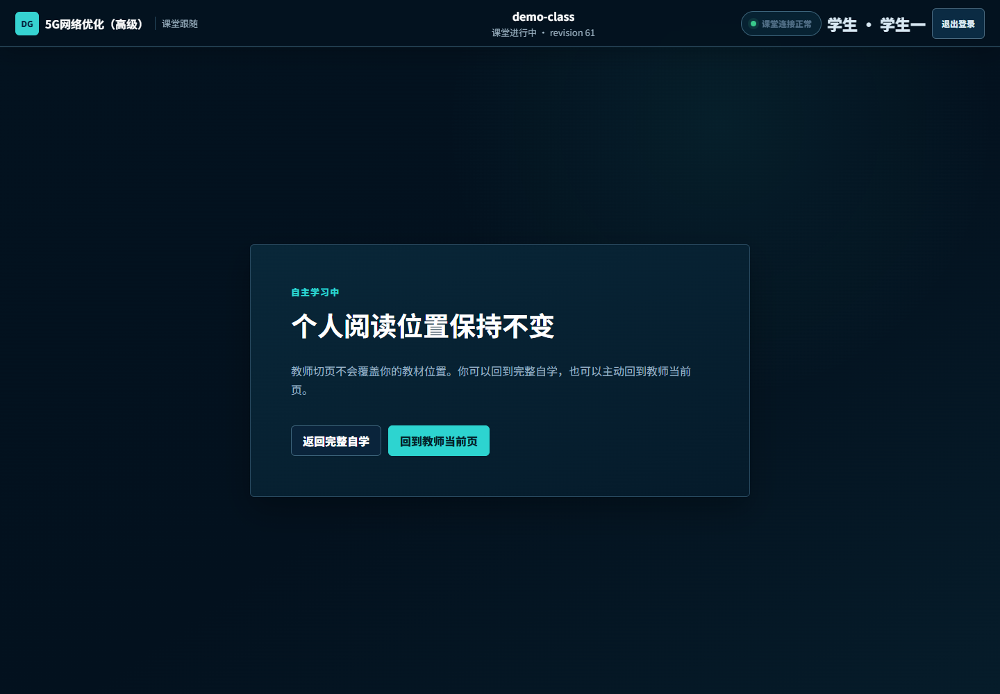

### 4.5 独立正式测试

N02 微练习通过后，学习页提供“进入正式测试”。也可从能力图谱选中对应正式测试节点，点击“进入正式测试”。P01 地址为 `/learn/P1T1-N02/test`。

正式测试与普通学习页分离，包含四个分项：

1. 证据分类：单选。
2. 链路重建：按顺序选择链路对象。
3. 成果修订：多选需要修订的缺陷。
4. 职业结论：填写“已确认事实、证据缺口、业务风险、复核动作”。

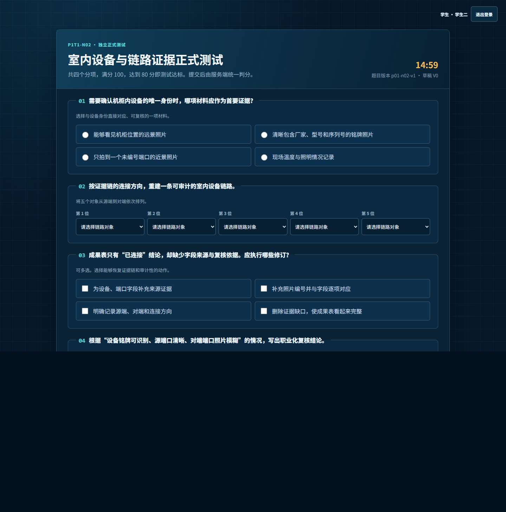

答题停止编辑 500ms 后系统自动保存草稿；刷新不会重置试卷和倒计时。点击“提交正式测试”后由服务端统一判分，生成总分及四个分项诊断。

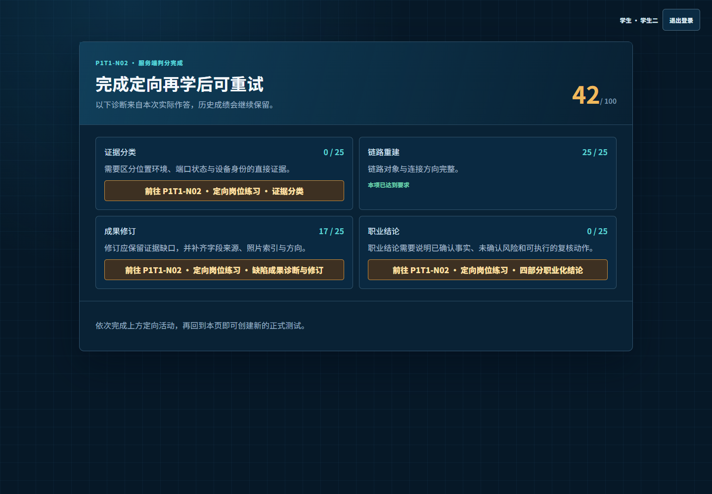

当前版本的真实闭环中，`student01` 四个分项均获得 25 分，总分 100 分，页面明确显示“正式测试达标”。这是用户真实作答形成的成绩，不是预置演示分数；测试达标后返回节点继续完成 N03、N04 和专业产出。

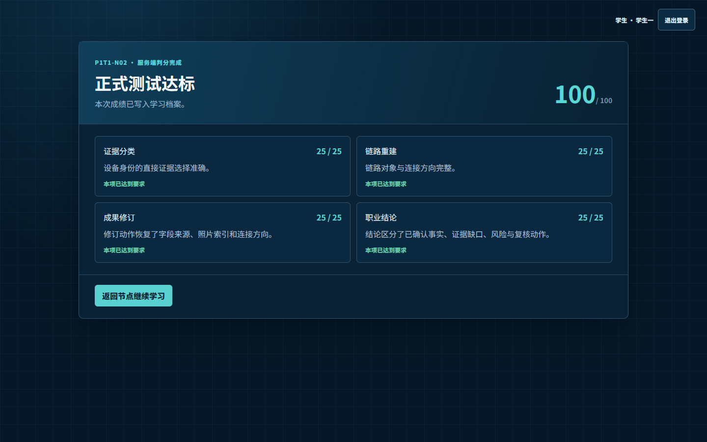

未达标时，系统显示“完成定向再学后可重试”，每个薄弱分项提供对应活动入口。完成全部指定活动后，返回测试页创建新测试。测试达标不等于教师认证；需要教师认证的节点还必须完成专业成果和教师复核。

### 4.6 N04 专业成果：提交、退回、修订、确认

P01 成果节点的普通自学地址为 `/learn/P1T1-N04`；进入真实成果工作区时使用 `/learn/P1T1-N04?mode=challenge`。完成 N04 自学与练习后填写“室内设备与链路证据表”。页面按真实表单显示字段、活动来源、证据挂接、评价标准、当前版本和流程状态。

若希望先看完整结构，可使用 `student03` 打开该页面：该人物展示演示数据中的已认证版本、证据挂接、评价标准和教师确认状态。该账号适合预览结构，不用于证明真实提交。首次填写时同一工作区会提供“保存草稿”和“提交教师复核”，但只有真实解锁 N04 的学生才能进入，不能通过 URL 绕过前置节点。

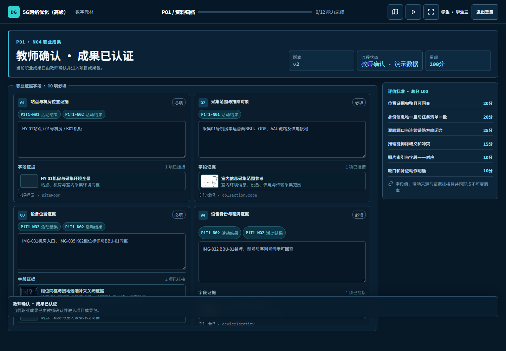

每个字段必须二选一：挂接可复核证据，或同时填写“证据缺口”和“下一步补证动作”。只写缺口、只写动作或完全留空都不能提交。

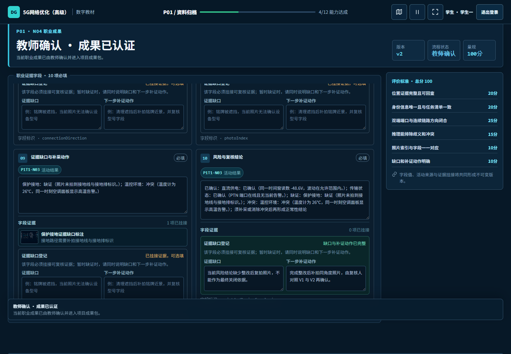

首次填写流程：

1. 填写所有必填字段。
2. 按字段挂接照片或证据。
3. 对不能确认的内容登记证据缺口和下一步动作，不要猜测。
4. 可先点击“保存草稿”；提示“草稿已保存，尚未提交教师”。
5. 字段完整后点击“提交教师复核”；提示“专业产出已提交，等待教师复核”。

当前版本已由 `student01` 真实走通以上流程。V1 汇总 N01—N03 的活动结果，挂接 9 个字段证据，并在“风险与复核结论”字段登记“整改后复拍照片尚缺”和下一步补证动作。证据暂缺时必须明确记录缺口与动作，不能用猜测补全。

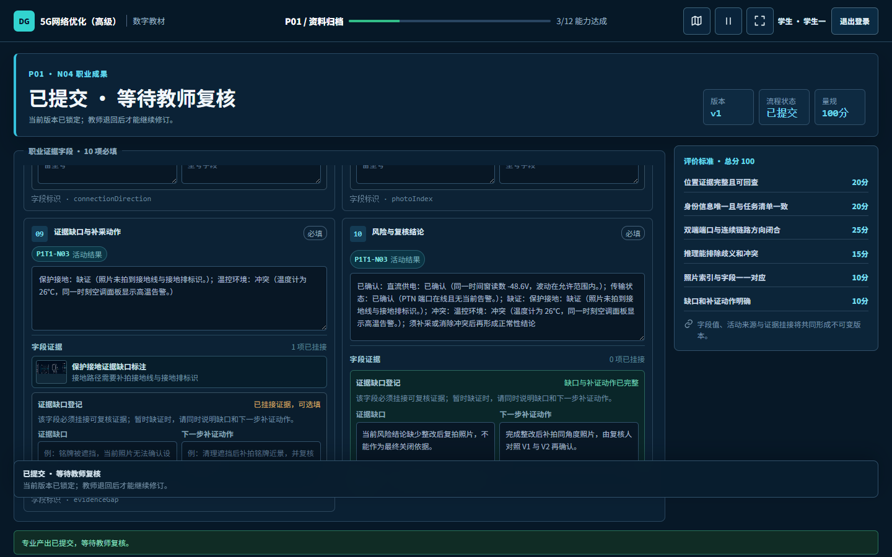

提交后表单只读。教师在复核台按字段检查证据、来源和缺口；本次真实流程对“连接方向与中间路径”写入具体批注，并以“请补齐双端端口和连续路径证据”为整体反馈执行退回。学生看到教师反馈后，修改字段或证据，状态从“教师退回”进入“修订中”；保存修订并再次提交后形成 V2，V1 保留不被覆盖。

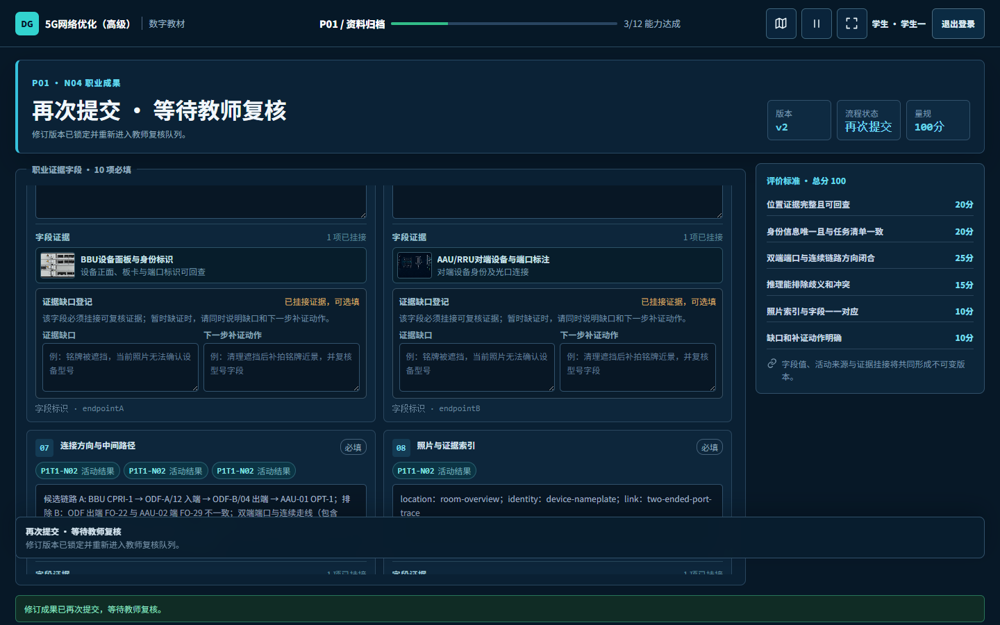

教师重新打开 V2，完成全部量规评分并满足认证门禁后，点击“确认认证并冻结成绩”。当前真实闭环冻结任务综合分 100 分；教师端显示认证完成，学生端同步显示“教师确认 · 成果已认证”和 V2。

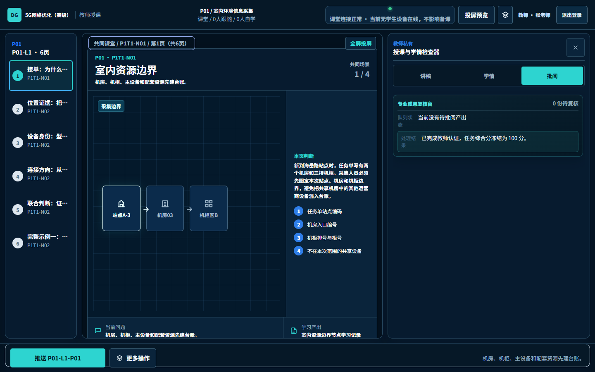

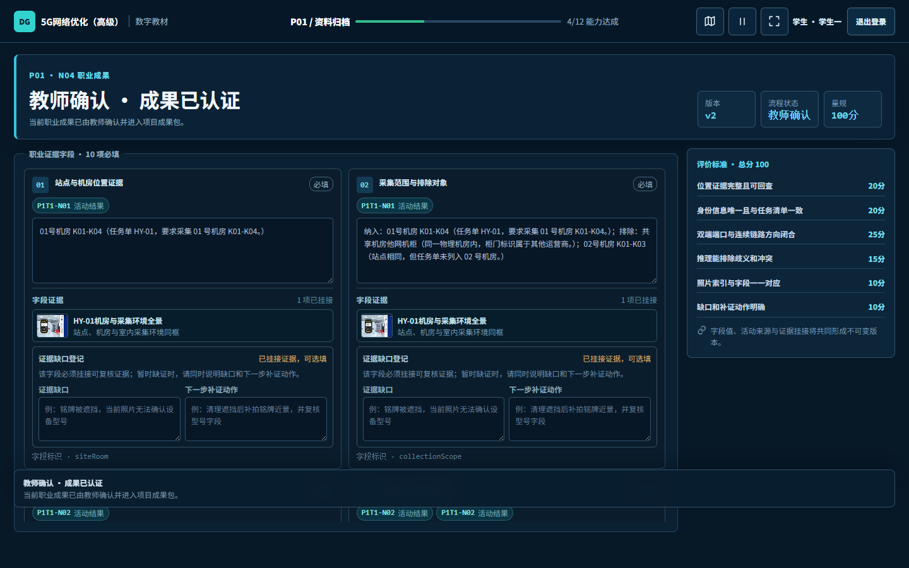

学生二重置后处于教师退回的演示状态。登录 `student02`，进入 `/learn/P1T1-N04?mode=challenge`，可看到“教师退回修订”和具体反馈；修改字段或证据后，页面会进入修订中，可用于讲解保存修订与版本差异。由于该人物的前置记录明确标记为演示数据，不能把它直接冒充真实再次提交。要完整演示“再次提交教师复核”，请让学生一按真实流程完成前置练习、正式测试和首次提交，再由教师退回；再次提交会形成新版本，不覆盖旧版本。

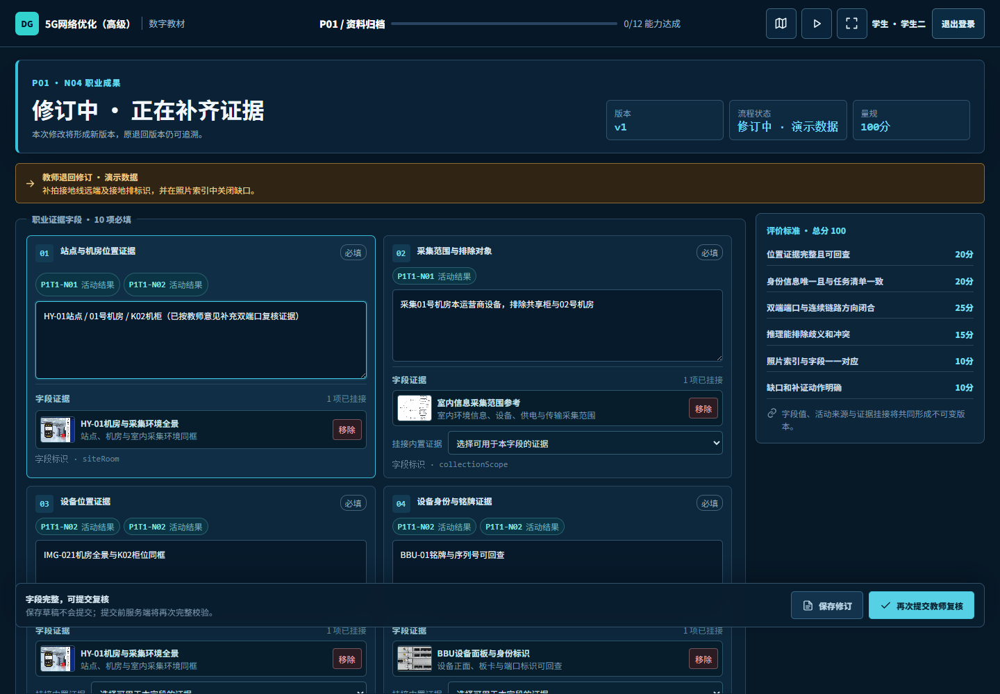

状态顺序为：编辑中 → 已提交 → 教师退回 → 修订中 → 再次提交 → 教师确认。没有真实填写、提交和教师确认，页面不会显示能力达成。

### 4.7 项目成果包

从 P1 项目页点击“查看成果包进度”或“查看项目成果包”，进入 `/student/projects/p1/portfolio`。

学生三重置后已有三份明确标记为“演示数据”的完整成果，可用于查看交付形态。成果包只引用三份已认证的不可变版本，不复制第四份成果内容。

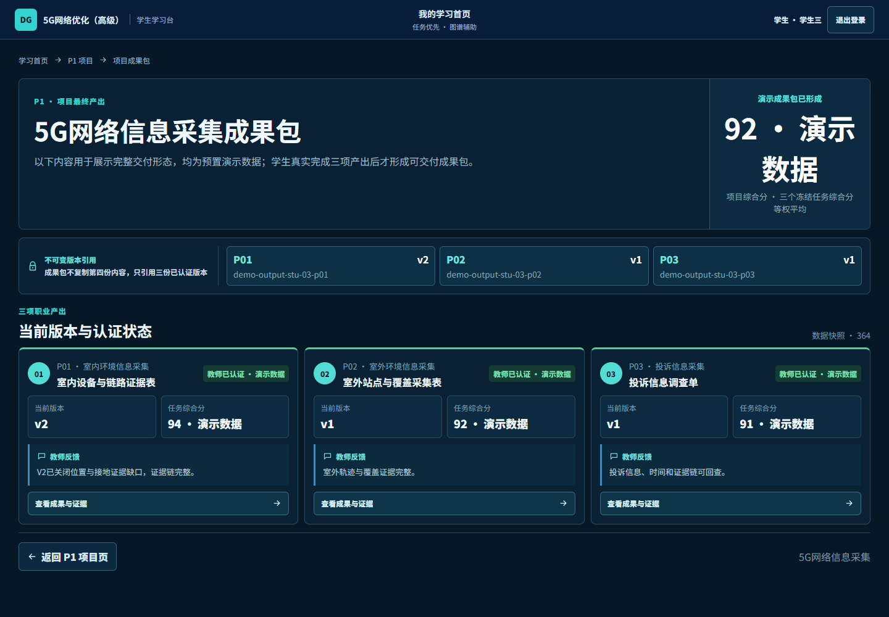

点击任一成果的详情入口，可查看：

- 每个版本的真实字段值；
- 每个字段关联的图片或证据；
- 学习活动来源；
- 教师字段批注和整体反馈；
- V1 → V2 字段、证据与来源差异；
- 正式测试四项诊断；
- 对应能力节点。

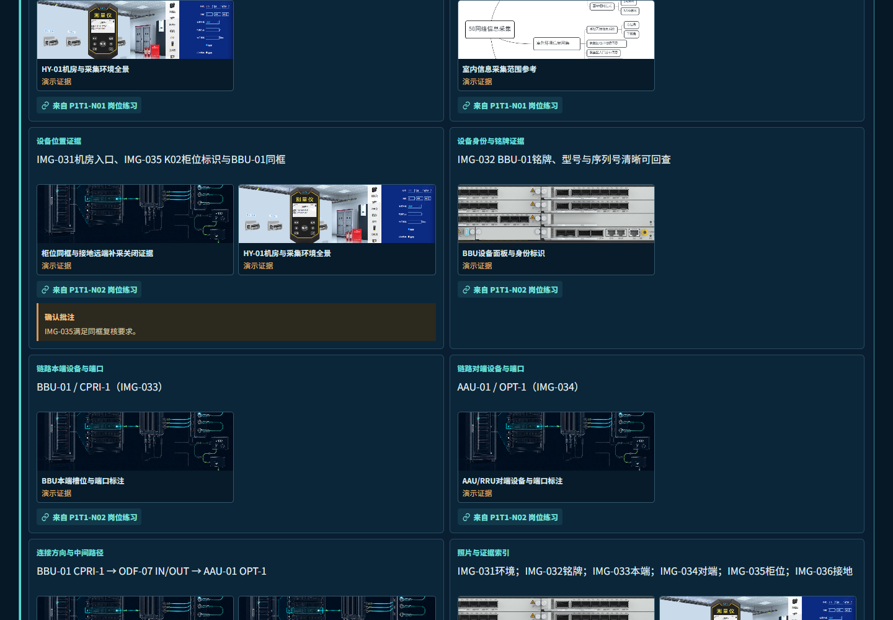

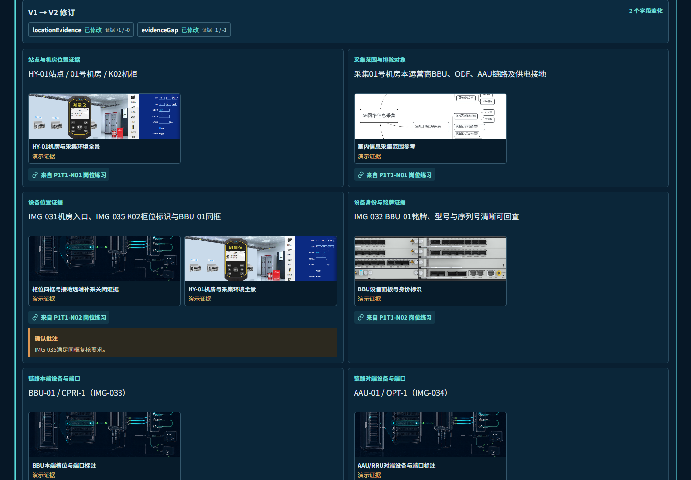

在真实学习记录模式下，若三份真实成果未全部教师确认，页面显示“成果包尚未形成”，不会用草稿、旧版本或模拟分数拼接可交付成果。重置基线中的 `student03` 会显示“演示成果包已形成”，并明确标注演示数据，只用于查看完整交付形态。

真实闭环验收时，`student01` 已形成可打开的 P01 V2 交付成果，P01 状态为“教师已认证”，P02 已解锁并成为下一任务，P03 仍待解锁。此时只能称为“P01 已完成”，不能称为“P1 项目已完成”；必须继续形成并认证 P02、P03 两份成果后，P1 项目成果包和项目综合分才会形成。交付前已恢复干净演示基线，如需复查该状态，请按本教程重新完成真实闭环。

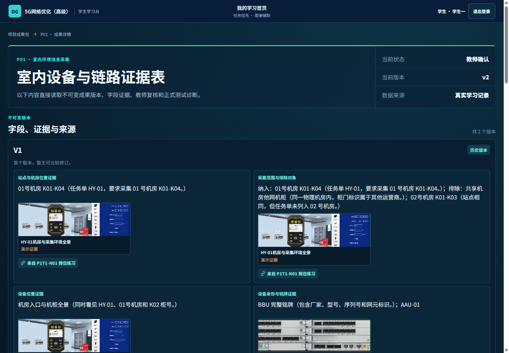

### 4.8 课程能力图谱

从学生首页点击“课程能力图谱”进入 `/course`。左侧可切换“我的路径 / 课程全图 / 学习成绩”；顶部支持搜索、缩放、返回全景和查看专家图谱。

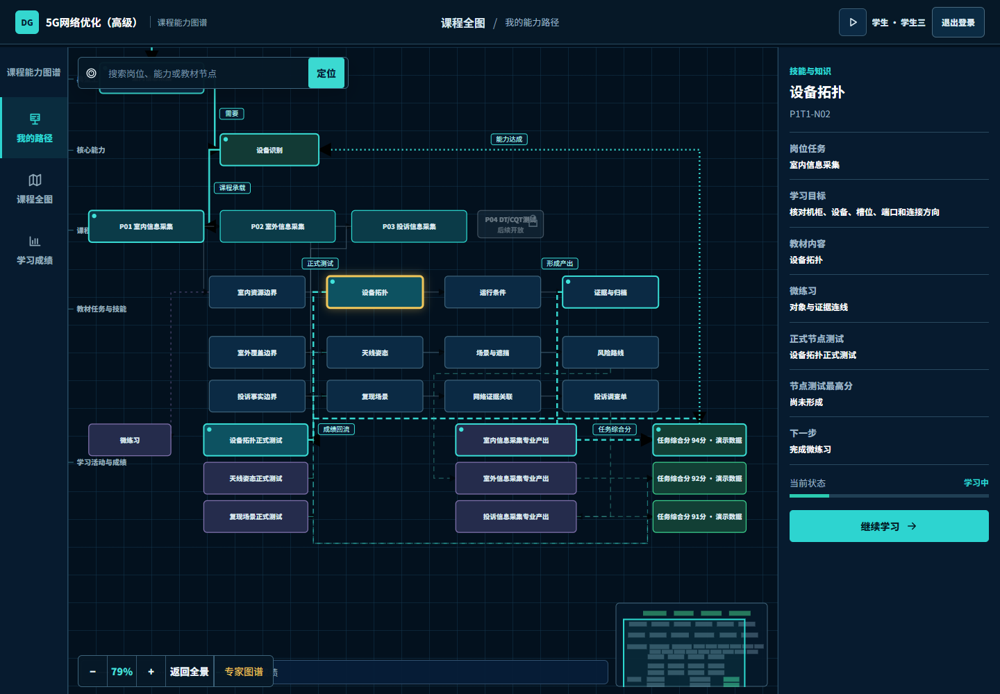

选中节点后，右侧详情显示岗位任务、学习目标、教材内容、微练习、正式节点测试、节点测试最高分和下一步。按钮根据节点类型显示“继续学习”“进入正式测试”或“进入成果表”。锁定节点按钮不可用，并显示前置状态。

图谱状态与学生端、教师端读取同一份实时数据。正式测试分数、任务综合分和教师认证不会相互替代。

当前版本的真实闭环已把 `student01` 的 N02 正式测试达标、N04 教师认证和任务综合分 100 分回流到图谱。图中 N02、N04 显示能力达成，P02 路径开放；这证明 P01 闭环完成，但并不表示 P02、P03 或整个 P1 项目已经完成。

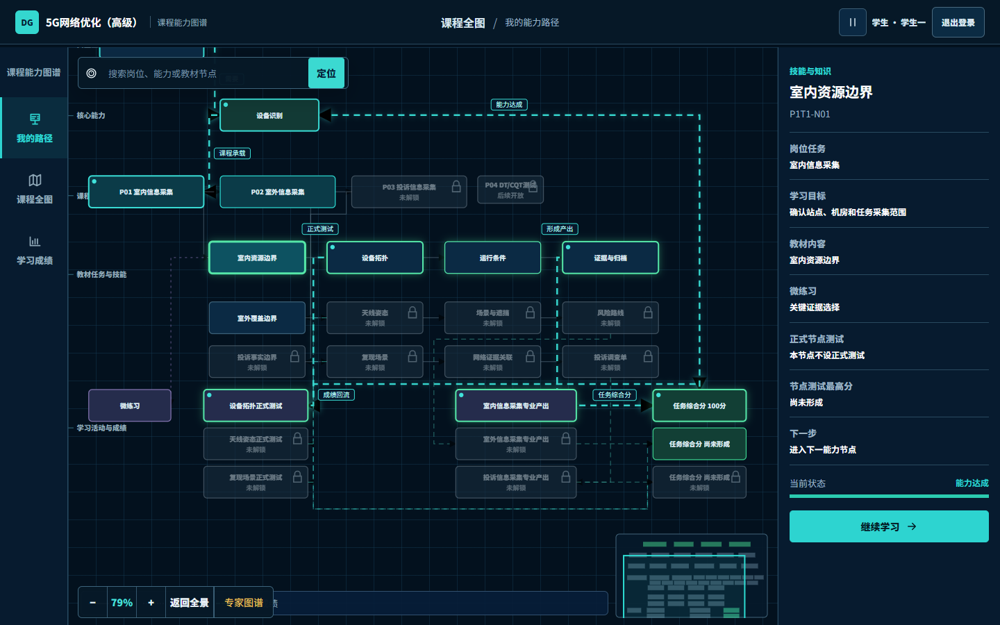

## 5. 教师端

### 5.1 授课工作台

教师登录后进入 `/teacher/workbench`。工作台显示当前课程、演示班级、在班学生、最近一次授课位置、班级实时概览、待批阅专业产出、班级薄弱点和课程能力图谱入口。

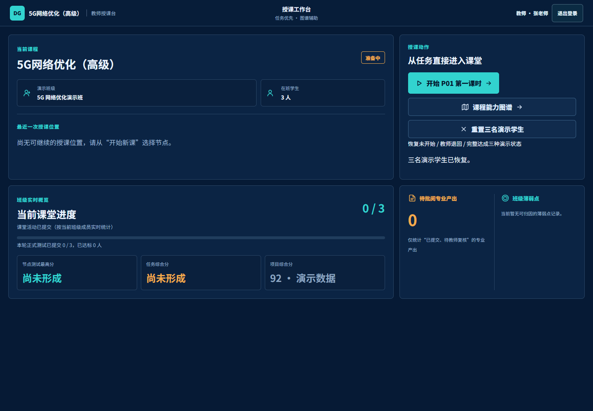

只有存在真实的进行中或暂停课时时，工作台才显示“继续授课”。执行“重置三名演示学生”后，课堂处于“准备中”，没有活动课时、课堂参与或可继续的授课运行；系统不会制造一个假的暂停位置。

从干净状态开始 P01 第一课时：

1. 展开工作台主入口；干净状态下按钮显示“开始 P01 第一课时”，有历史授课上下文时可能显示“开始新课”。
2. 点击 `P1T1-N02 · 设备拓扑`。这是进入 P01 第一课时目标页的第二次点击。
3. 系统创建并启动真实课时运行，再进入 `/teacher/sessions/demo-class`。

已有暂停课时时，点击“继续授课”进入授课页，再点击页面底部“继续课堂”恢复教师、投屏和课堂跟随端同步。第一课时结束后，如需准备 P01 第二课时，先从“更多操作”选择“结束课堂”，返回工作台并从新课入口选择 `P1T1-N03` 或 `P1T1-N04`。同一时刻只允许一个进行中或暂停的课时，未关闭旧课时前不能再开新课。

如果提示“状态已刷新，请再次点击”，再次点击同一目标即可；这是并发状态保护，不代表数据丢失。

### 5.2 P01 两课时授课包

P01 由两个 45 分钟课时组成，每课时 6 页：

#### 第一课时：建立室内设备与链路证据判断框架

1. 接单：为什么一组清晰照片仍会被退回。
2. 位置证据：把设备放回唯一现场坐标。
3. 设备身份：型号、序列号与现场对象必须同框回指。
4. 连接方向：从源端口沿连续走线找到对端。
5. 联合判断：证据分类、链路重建与职业结论。
6. 完整示例一：机柜 02 至 AAU5619 证据链闭合。

#### 第二课时：诊断缺陷并形成可复核专业记录

1. 复盘：三问法快速定位证据缺口。
2. 完整示例二：经过 ODF 跳接的链路重建。
3. 反例一：正确铭牌挂到了错误机柜。
4. 反例二：端口正确，但连接方向被想当然补全。
5. 成果形成：检查并修订室内设备与链路证据表。
6. 迁移与收束：独立完成 P01T1-N02 职业判断。

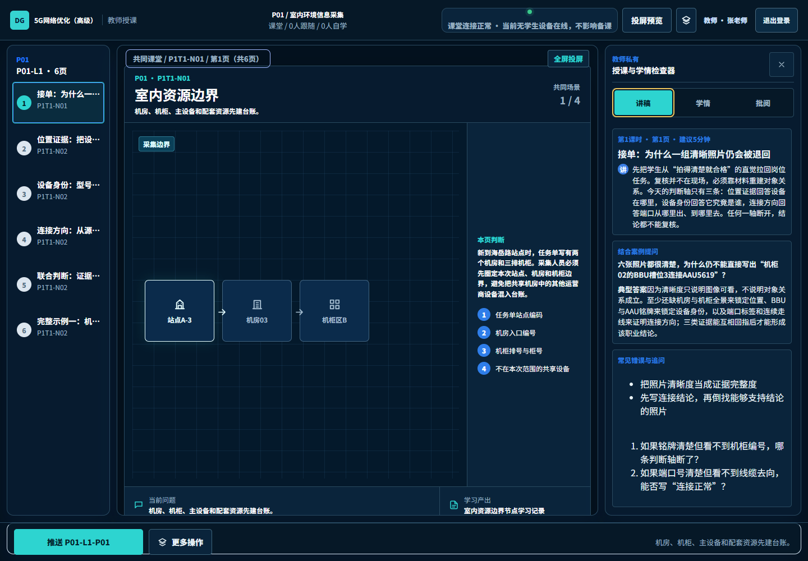

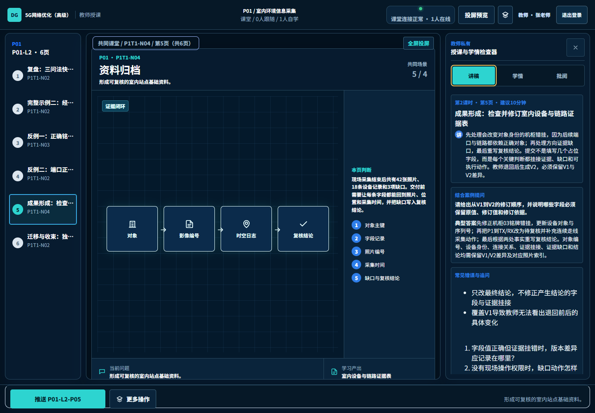

左侧为当前课时 6 页结构，中间为共同课堂画面，右侧检查器为教师私有信息。教师可直接按页面提供的建议时间、投屏材料、讲解、案例提问、典型答案、常见错误、追问、学生动作和过渡语授课，无需另做 PPT。

### 5.3 课堂控制与三端同步

教师授课页底部只有一个随课堂阶段变化的主动作，例如“开始本课”“推送 …”“启动正式测试”“进入讲评”“下一页”或“结束课堂”。“更多操作”中提供：

- 上一页、下一页；
- 打开播报 / 收起播报；
- 暂停课堂 / 继续课堂；
- 暂停测试 / 继续测试 / 提前收卷；
- 进入讲评；
- 结束课堂。

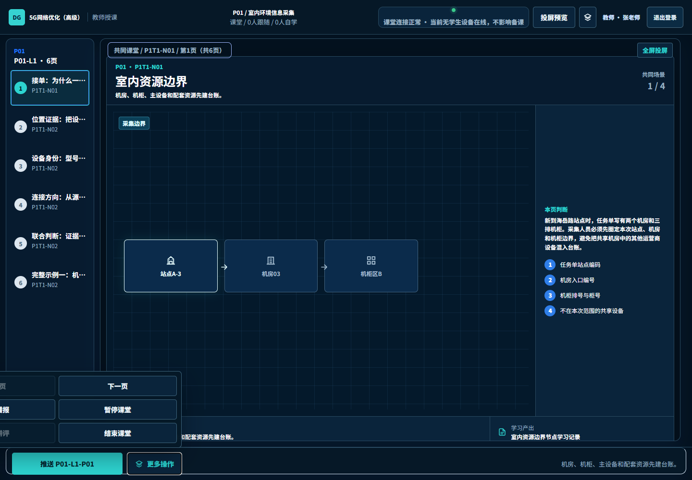

教师切页后，投屏与处于“课堂跟随”的学生同步变化；处于“自主浏览”的学生不被强制跳页。页面顶部显示课堂连接状态：

- “课堂连接正常”：可以同步操作；即使当前没有学生设备在线，也可备课。
- “课堂连接暂时离线”：主动作变为“重新连接课堂”；同步操作停止，先检查网络并重连。
- 课堂暂停时，学生课堂活动只读，投屏翻页同步停用。

### 5.4 正式测试与匿名讲评

当授课页进入带正式测试的页面后，点击“启动正式测试”。学生课堂跟随页出现“进入独立正式测试”；投屏只显示统一倒计时、应交人数、已交人数和达标人数，不显示个人作答或个人成绩。

教师检查器“学情”页显示当前正式测试已提交人数、节点测试均分、达标率、成绩分布和能力薄弱点。

0 份提交时，“进入讲评”不可用并显示“等待学生提交”。至少收到 1 份当前测试提交且收卷条件满足后，点击“进入讲评”。投屏讲评页只显示“证据分类、链路重建、成果修订、职业结论”的匿名错误人数和比例。

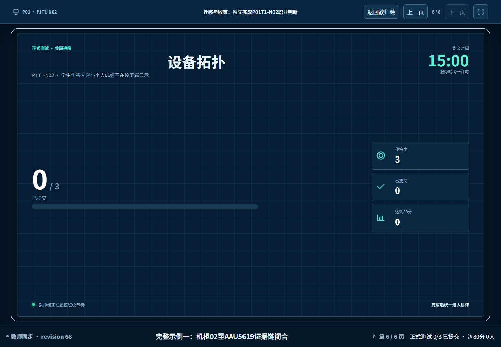

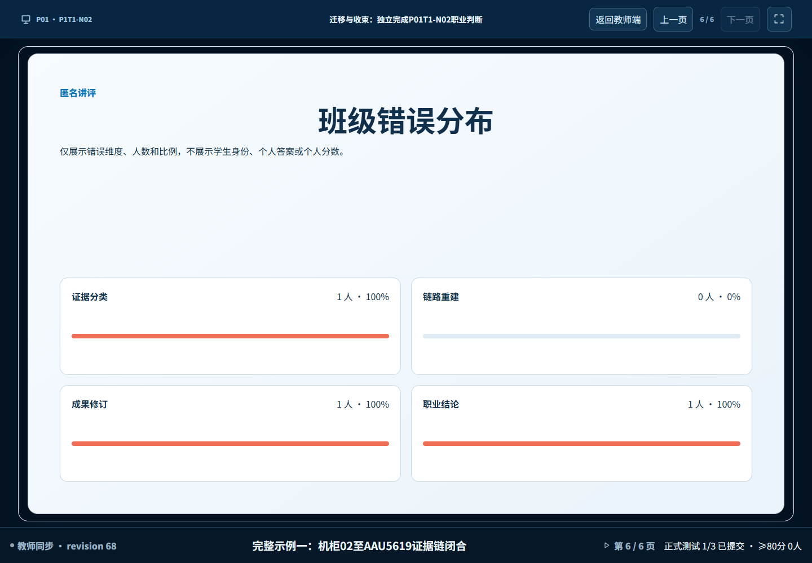

### 5.5 专业成果复核

在教师授课页右上角点击检查器按钮，切换到“批阅”。“专业成果复核台”列出“已提交、待教师复核”的成果。选择一份成果后，依次核验：

重置基线中的退回与已认证成果均明确属于演示数据，不会伪装成新的真实待复核提交，因此基础截图 `29` 展示空队列门禁。要看到完整批阅表单，需先让学生按真实流程形成并提交一份用户成果；当前版本已经用 `student01` 的 V1、V2 完成这条真实流程。

1. 当前版本、版本总数和状态。
2. 字段值、证据、来源与缺口。
3. 退回前后的版本变化。
4. N02 正式测试四项诊断。
5. 每个字段的本次批注。
6. 全部量规评分和教师整体反馈。

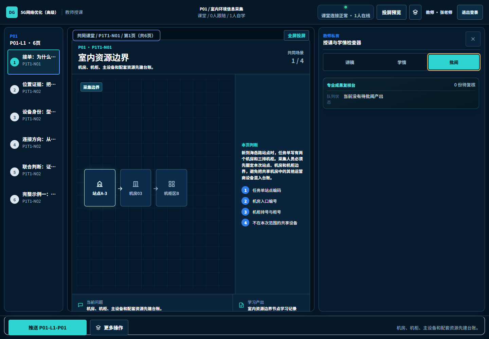

需要修改时，整体反馈至少 8 个字符，并指出证据问题与改正动作，然后点击“退回修订”。确认认证前必须满足：全部量规已评分、各项达到最低要求、总分至少 80 分，并存在真实正式测试达标记录。满足后点击“确认认证并冻结成绩”。

教师确认会冻结任务综合分；它不是由“正式测试 100 分”或成果名称自动生成。

当前真实闭环中，教师先对 V1 的连接方向字段写入批注并退回，学生形成 V2 后，教师完成全部量规评分并认证，最终冻结任务综合分 100 分。认证后该成果立即从待复核队列移除，检查器保留本次处理结果。

### 5.6 重置三名演示学生

需要重新演示完整流程时，在教师工作台点击“重置三名演示学生”，阅读确认提示后确认。系统恢复为：学生一未开始、学生二教师退回演示状态、学生三完整达成演示状态；同时清理旧课堂运行态，使课堂回到“准备中”且没有活动课时。课程、班级、账号和素材不会删除。

此动作会清除本轮三名演示学生产生的学习、测试、成果和课堂参与数据。正式讲评、截图或演示进行中不要重置。

重置后可直接按 5.1 节展开新课入口并选择 `P1T1-N02`，两次点击进入 P01 第一课时。重置会删除 `student01` 的真实学习、测试、成果和课堂参与记录；需要保留当前闭环证据时不要执行重置。

## 6. 投屏端

教师登录后访问 `/present/demo-class`，或在教师授课页点击“投屏预览 / 全屏投屏”。投屏端只展示全班共同焦点，不展示教师讲稿、学生姓名、个人答案或个人成绩。

投屏端不设置账号菜单或“退出登录”，以避免公开画面出现身份操作。需要结束教师会话时，先点击“返回教师端”，再在教师页面点击“退出登录”。

顶部控制包括：

- “返回教师端”；
- “上一页”；
- 当前页码；
- “下一页”；
- “进入全屏 / 退出全屏”。

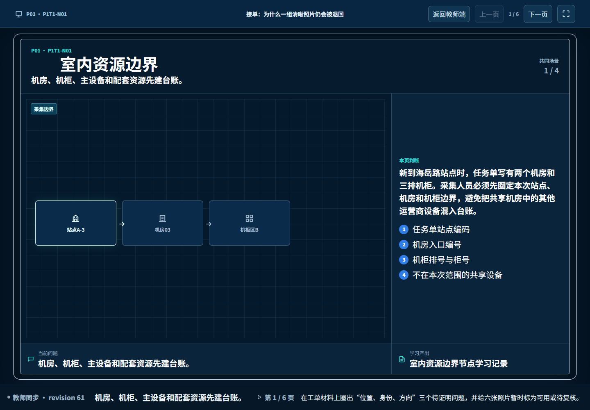

投屏翻页和教师翻页写入同一课堂游标，另一端会同步更新。课堂离线或暂停时，翻页按钮停用并显示原因。没有进行中课时时，投屏显示“等待教师准备下一课时”，不会回退到其他课时内容。

## 7. 统一状态与正确判读

节点状态按真实事件推进：

`未解锁 → 可学习 → 学习中 → 微练习通过 → 正式测试达标 → 专业产出已提交 → 待教师复核 → 退回修订 / 教师认证 → 能力达成`

各节点会按节点配置跳过不适用环节：N01、N03 不要求正式测试，N02 不要求专业产出复核，N04 承担专业产出与教师认证；是否需要教师认证由配置决定，不由前端临时判断。

判读原则：

- 打开页面不等于完成学习。
- 完成微练习不等于能力达成。
- 正式测试达标不等于教师认证。
- 有成果名称不等于成果已经形成。
- 没有学生提交，不会出现待复核成果。
- 没有教师确认动作，不会显示教师认证。
- 学生端、教师端、投屏端和能力图谱使用同一套实时数据；刷新后人数、提交数、成绩和状态应一致。

## 8. 常见问题

### 登录后进入了错误页面

先点击右上角“退出登录”，再用正确账号登录。学生账号只进入学生、学习和课堂跟随入口；教师账号只进入教师授课和投屏入口。

### 节点显示锁定，但我知道 URL

锁定状态由服务端数据决定。直接访问 URL 仍显示“节点尚未解锁”和前置节点，不会加载教材、练习或提交功能。先完成页面列出的前置节点。

### 打开 N02 正式测试时提示先完成微练习

返回 `/learn/对应节点`，完成该节点全部必需微练习，达到“微练习通过”后再进入测试。

### 正式测试未达标，为什么不能立即重新开始

先完成分项诊断提供的定向再学活动。全部目标完成后，系统才开放新测试，防止只靠重复猜题刷分。

### 学生被教师翻页打断

在课堂跟随页点击“自主浏览”，再点击“返回完整自学”。个人阅读游标不会被课堂游标覆盖；需要同步时再点“回到教师当前页”。

### 教师点击“进入讲评”没有反应

0 份提交时按钮被禁用。先让至少一名已加入当前课堂测试的学生提交；必要时先“提前收卷”，再进入讲评。

### 教师无法“确认认证并冻结成绩”

查看“认证门禁尚未满足”列表。通常原因是量规未填完整、单项或总分未达标，或学生没有真实正式测试达标记录。演示分数不能替代真实认证条件。

### 成果表显示“教师退回”，却不能直接再次提交

先修改至少一个字段或证据，使状态进入“修订中”；再点击“再次提交教师复核”。系统会形成新版本并保留旧版本。

### 成果包显示“尚未形成”

P01、P02、P03 三份任务成果必须全部真实提交并经教师确认。草稿、退回状态、旧版本和演示分数不会被拼成真实成果包。

### 课堂显示离线

教师点击“重新连接课堂”或刷新页面；检查服务器和浏览器网络。离线期间不要反复点击同步动作，系统会明确阻止翻页和测试控制。

## 9. 路由速查

| 页面 | URL | 身份 |
|---|---|---|
| 登录 | `/` | 免登录 |
| 平台总览 | `/platform` | 免登录 |
| 学生首页 | `/student/home` | 学生 |
| P1 项目 | `/student/projects/p1` | 学生 |
| P1 成果包 | `/student/projects/p1/portfolio` | 学生 |
| P01/P02/P03 成果详情 | `/student/projects/p1/portfolio/P01` 等 | 学生 |
| 节点自学 | `/learn/P1T1-N02` 等 | 学生 |
| 节点正式测试 | `/learn/P1T1-N02/test` 等 | 学生 |
| 课堂跟随 | `/classroom/demo-class` | 学生 |
| 课程能力图谱 | `/course` | 学生或教师 |
| 教师工作台 | `/teacher/workbench` | 教师 |
| 教师授课 | `/teacher/sessions/demo-class` | 教师 |
| 投屏 | `/present/demo-class` | 教师 |

## 10. 详细截图采集清单

截图统一保存到 `docs/guides/assets/dgbook-p1/`，视口建议桌面端 `1440 × 1000`；长页面使用整页截图，交互状态页使用当前视口截图。截图前关闭浏览器书签栏、下载提示和开发者工具。

| 文件名 | 页面 URL | 登录角色 / 前置状态 | 关键动作与必须入镜内容 |
|---|---|---|---|
| `01-login-gateway.png` | `/` | 免登录 | 登录表单、3 个学生账号、1 个教师账号、默认密码、“进入教材”“查看平台总览” |
| `02-account-logout.png` | `/student/home` | student01 | 右上角身份“学生 · 学生一”和“退出登录” |
| `03-student-home-four-questions.png` | `/student/home` | student01，刚重置 | 当前项目/任务/节点、为什么学、下一步、完成标准、“继续学习”和两个次级入口 |
| `04-p1-project-three-tasks.png` | `/student/projects/p1` | student03 | P01 → P02 → P03、三个任务状态、项目最终产出 |
| `05-p01-node-chain.png` | `/student/projects/p1#p1-task-P01` | student01 | 展开 P01，四节点、完成标准、任务专业产出和成绩口径 |
| `06-n02-problem.png` | `/learn/P1T1-N02` | student03；或已完成 N01 的 student01 | 选择“问题”，案例背景、任务问题、必要前置知识、六段导航 |
| `07-n02-annotated-figure.png` | 同上 | 同上 | 选择“看图”，带标注关系图、判断依据、术语查询 |
| `08-n02-reasoning-examples.png` | 同上 | 同上 | 选择“步骤”，逐步推理和至少一个完整示例 |
| `09-n02-counterexamples.png` | 同上 | 同上 | 选择“纠偏”，错误做法和改正路径 |
| `10-n02-practice-feedback.png` | 同上 | 同上 | 选择“练习”，完成一次错误作答，反馈、改正路径和重新作答入口同屏 |
| `10b-n02-transfer-power-chain.png` | 同上 | 同上 | AAU 直流供电链迁移任务，包含 AAU、PWR、DCDU、端口、电压与方向字段 |
| `11-n02-output-rubric.png` | 同上 | 同上 | 选择“产出”，模板、迁移任务、评价标准、底部主动作 |
| `12-student-classroom-entry.png` | `/classroom/demo-class` | student01；教师已开课，学生未加入 | “尚未进入课堂”“进入课堂”“返回完整自学” |
| `13-student-classroom-follow.png` | 同上 | student01 已点击“进入课堂” | 当前课堂页、教师任务、课堂活动、“返回完整自学”“自主浏览” |
| `14-student-self-mode.png` | 同上 | 在跟随页点击“自主浏览” | “个人阅读位置保持不变”“返回完整自学”“回到教师当前页” |
| `15-formal-assessment-paper.png` | `/learn/P1T1-N02/test` | 已通过 N02 微练习的学生 | 倒计时、题目版本、四类题型、“提交正式测试” |
| `16-formal-assessment-diagnosis.png` | 同上 | 提交一份测试 | 总分、四项分项诊断、达标或定向再学入口 |
| `17-n04-output-form.png` | `/learn/P1T1-N04?mode=challenge` | student03，已认证完整成果 | 真实字段、证据挂接、评价标准、冻结版本和教师确认状态 |
| `17b-n04-evidence-gap.png` | 同上 | student01，真实 V2 | 单字段证据挂接，以及无证据字段的“缺口 + 下一步补证动作”完整登记 |
| `18-output-return-revise.png` | `/learn/P1T1-N04?mode=challenge` | student02，修改一个退回字段后 | 教师反馈、修订状态、“保存修订”“再次提交教师复核” |
| `19-p1-portfolio.png` | `/student/projects/p1/portfolio` | student03 | 三项职业产出、不可变版本引用、项目综合分及演示数据说明 |
| `20-portfolio-output-evidence.png` | `/student/projects/p1/portfolio/P01` | student03 | V2 字段、证据图片、活动来源、字段批注 |
| `20b-real-p01-deliverable.png` | 同上 | student01，真实闭环验收时 | 真实 V2、教师确认、不可变版本、字段、证据与来源 |
| `21-portfolio-version-diff.png` | 同上 | student03 | V1 → V2 差异、退回与确认记录、正式测试诊断 |
| `22-capability-map-student.png` | `/course` | student03 | P1 三任务路径、节点状态、右侧详情、任务/项目成绩 |
| `23b-teacher-workbench-clean.png` | `/teacher/workbench` | teacher01；最终交付重置后，课堂准备中且无活动课时 | 当前课程、演示班级、3 名学生、开始 P01 第一课时、待批阅和薄弱点；无虚假的“继续授课” |
| `24-teacher-p01-lesson1.png` | `/teacher/sessions/demo-class` | teacher01；从干净工作台新开 P01 第一课时 | 共同课堂第 1 页、左侧 6 页、检查器“讲稿”中的建议时间/讲解/典型答案 |
| `25-teacher-p01-lesson2.png` | 同上 | teacher01；已结束第一课时并新开 P01 第二课时第 5 页 | “成果形成”共同画面、讲稿、学生动作和过渡语 |
| `26-teacher-classroom-controls.png` | 同上 | teacher01；课堂 active | 连接状态、投屏入口、底部主动作、展开“更多操作” |
| `27-projector-formal-test.png` | `/present/demo-class` | teacher01；正式测试 running | 统一倒计时、应交/已交/达标人数、无个人信息 |
| `28-projector-anonymous-review.png` | 同上 | teacher01；至少 1 份提交后进入讲评 | “匿名讲评”、四项错误分布、隐私说明 |
| `29-teacher-output-review.png` | `/teacher/sessions/demo-class` | teacher01；重置基线 | 打开检查器“批阅”，显示真实待复核队列的空状态门禁；有真实提交时同区显示字段、证据、量规及复核动作 |
| `31-student01-formal-assessment-passed.png` | `/learn/P1T1-N02/test` | student01；真实完成正式测试 | 总分 100，证据分类、链路重建、成果修订、职业结论四项各 25 分 |
| `32-student01-output-v1-submitted.png` | `/learn/P1T1-N04?mode=challenge` | student01；真实提交 V1 | 9 个证据字段、证据挂接、缺口登记及“已提交”状态 |
| `33-student01-output-v2-resubmitted.png` | 同上 | student01；按教师字段批注修订后再次提交 | V2 版本、修订内容及“再次提交”状态 |
| `34-teacher-output-verification-result.png` | 教师成果复核台 | teacher01；真实确认 student01 V2 | 字段批注、量规评分、教师确认结果与冻结的 100 分 |
| `35-student01-output-verified.png` | `/learn/P1T1-N04?mode=challenge` | student01；教师确认后 | 专业成果教师确认、版本与能力状态回流 |
| `36-student01-home-after-p01-verification.png` | `/student/home` | student01；P01 闭环完成后 | P01 已完成、任务综合分 100、当前 N04 与下一步入口 |
| `37-student01-course-graph-p01-achieved.png` | `/course` | student01；P01 闭环完成后 | N02/N04 能力达成、P02 可学习；P1 项目仍未完成 |
| `30-projector-controls.png` | `/present/demo-class` | teacher01；课堂 active | 返回教师端、上一页、下一页、页码、全屏按钮和共同画面 |

### 截图状态编排建议

1. `01`—`30` 是基础界面基线，带 `b` 后缀的图片是当前版本补充证据。如需重新采集，先确认不需要保留当前真实闭环状态，再由教师执行“重置三名演示学生”；重置后课堂应处于“准备中”且没有活动课时。
2. 使用 `student01` 截 `02`、`03`、`05`，保留 N02 的真实锁定状态；使用 `student03` 截 `04`、`06`—`11`、`17`、`19`—`22`；使用 `student02` 修改一个退回字段后截 `18`。这一阶段不要推进课堂。
3. 使用 `teacher01` 截干净工作台 `23b`；直接展开“开始 P01 第一课时/开始新课”，选择 `P1T1-N02` 新开第一课时，截 `24`、`26`、`30`。
4. 第一课时进行中，由 `student01` 进入课堂并依次截 `12`—`14`；完成后退出自主浏览，避免后续截图停留在个人位置。
5. 教师结束第一课时并返回工作台，从“开始新课”选择 `P1T1-N03` 或 `P1T1-N04` 新开 P01 第二课时。推进到第 5 页截 `25`，再推进到第 6 页启动正式测试并先截投屏 `27`。
6. 使用 `student02` 从课堂入口进入本轮独立正式测试，提交前截 `15`，真实提交后截 `16`；教师满足讲评条件后进入匿名讲评，截投屏 `28`。
7. 教师打开检查器“批阅”并截真实空状态 `29`。随后由 `student01` 真实完成正式测试、提交 V1、接收退回、修订为 V2，再由教师确认，依次形成 `31`—`37`；这些闭环证据已采集，保留证据时不要再次重置。

如果某截图所需真实状态尚未形成，不要用浏览器开发工具伪造。按流程完成对应学习、提交或教师动作后再截图。
